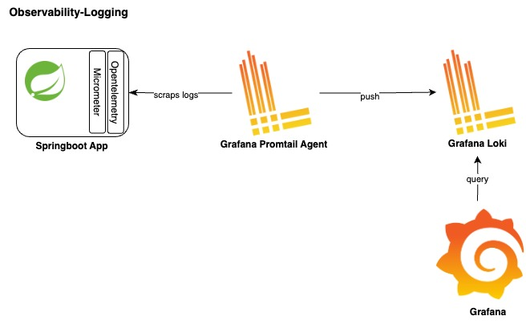

# Observability-Logging

Logging can be implemented

1. Using a scraping agent (eg grafana-promtail, Fluentd, FluentBit).

2. Using OTEL exporter to directly export logs to Log aggregation system like Loki, Elastic, Splunk etc

## Option 1: Using promtail agent to scrap logs from apps and pushing them to Loki



### Prerequisites

* Grafana
* Promtail
* Loki

### Application configuration

1. Add opentelemetry-logback-mdc-1.0 to pom.xml

<table style='font-family:"Courier New", Courier, monospace; font-size:100%'>
    <tr>
        <th colspan="2">Dependencies</th>
    </tr>
    <tr>
        <th>Name</th>
        <th>Description</th>
    </tr>
    <tr>
        <td>opentelemetry-logback-mdc-1.0</td>
        <td>Used to add trace and span info to (standard)logs via Logback</td>
    </tr>
</table>

2. Update /src/main/resources/logback.xml

```
<?xml version="1.0" encoding="UTF-8"?>
<configuration>
  <appender name="STDOUT" class="ch.qos.logback.core.ConsoleAppender">
    <encoder>
      <pattern>%d{HH:mm:ss.SSS} [%thread] %-5level %logger{36} trace_id=%X{trace_id} span_id=%X{span_id} %msg%n</pattern>
    </encoder>
  </appender>

  <appender name="OTEL_STDOUT" class="io.opentelemetry.instrumentation.logback.mdc.v1_0.OpenTelemetryAppender">
    <appender-ref ref="STDOUT" />
  </appender>
  <root level="info">
    <appender-ref ref="OTEL_STDOUT" />
  </root>
</configuration>
```

### Checking logs in grafana ui

```
login to grafana ui select 'Explore' from main menu
select 'Loki' as the source 
In 'Label filters' section, select 'app' from 'Select Label' drope-down and select your app-name from 'Select value' drope-down
Execute 'Run Query'
```

## Option 2: Using OTEL exporter to push logs to Loki


### Prerequisites

* Grafana
* Loki version 3.0.0 or higher(with native OTEL support)

### Application configuration

1. Add opentelemetry-logback-appender-1.0 to pom.xml

<table style='font-family:"Courier New", Courier, monospace; font-size:100%'>
    <tr>
        <th colspan="2">Dependencies</th>
    </tr>
    <tr>
        <th>Name</th>
        <th>Description</th>
    </tr>
    <tr>
        <td>opentelemetry-logback-appender-1.0</td>
        <td>A Logback appender that automatically sends logs to an OpenTelemetry-compatible backend</td>
    </tr>
</table>

2. Add custom configuration

```
@Bean
  public OpenTelemetry openTelemetry(
      final SdkLoggerProvider sdkLoggerProvider,
      final SdkTracerProvider sdkTracerProvider,
      final ContextPropagators contextPropagators) {
    final var openTelemetrySdk =
        OpenTelemetrySdk.builder()
            .setLoggerProvider(sdkLoggerProvider)
            .setTracerProvider(sdkTracerProvider)
            .setPropagators(contextPropagators)
            .build();
    OpenTelemetryAppender.install(openTelemetrySdk);
    return openTelemetrySdk;
  }

  @Bean
  public SdkLoggerProvider otelSdkLoggerProvider(
      final Environment environment, final ObjectProvider<LogRecordProcessor> logRecordProcessors) {
    final var applicationName = environment.getProperty("spring.application.name", "application");
    final Resource springResource =
        Resource.create(Attributes.of(ResourceAttributes.SERVICE_NAME, applicationName));
    final SdkLoggerProviderBuilder builder =
        SdkLoggerProvider.builder().setResource(Resource.getDefault().merge(springResource));
    logRecordProcessors.orderedStream().forEach(builder::addLogRecordProcessor);
    return builder.build();
  }

  @Bean
  public LogRecordProcessor otelLogRecordProcessor() {
    return BatchLogRecordProcessor.builder(
            OtlpGrpcLogRecordExporter.builder()
                .setEndpoint("http://localhost:9095/v1/logs") // grpc enpoint of external log server
                .build())
        .build();
  }
```

2. Update /src/main/resources/logback.xml to include OTEL_EXTERNAL appender

```
<?xml version="1.0" encoding="UTF-8"?>
<configuration>
  <appender name="OTEL_EXTERNAL" class="io.opentelemetry.instrumentation.logback.appender.v1_0.OpenTelemetryAppender">
    <captureExperimentalAttributes>true</captureExperimentalAttributes>
    <captureKeyValuePairAttributes>true</captureKeyValuePairAttributes>
  </appender>
  <root level="info">
    <appender-ref ref="OTEL_STDOUT" />
    <appender-ref ref="OTEL_EXTERNAL" />
  </root>
</configuration>
```

### Checking logs in grafana ui

```
login to grafana ui select 'Explore' from main menu
select 'Loki' as the source 
In 'Label filters' section, select 'app' from 'Select Label' drope-down and select your app-name from 'Select value' drope-down
Execute 'Run Query'
```

