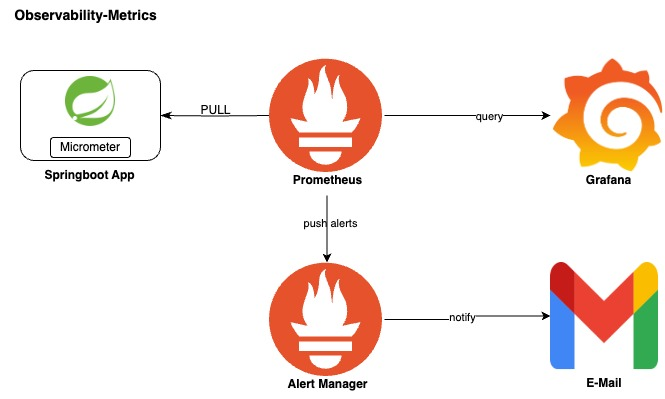

# Observability-Metrics



## Prerequisites

* prometheus server

## Metrics setup for springboot3

### Application configuration

1. Add spring-boot-starter-actuator, micrometer-registry-prometheus & micrometer-observation-test dependencies to pom.xml

<table style='font-family:"Courier New", Courier, monospace; font-size:100%'>
    <tr>
        <th colspan="2">Dependencies</th>
    </tr>
    <tr>
        <th>Name</th>
        <th>Description</th>
    </tr>
    <tr>
        <td>spring-boot-starter-actuator</td>
        <td>To expose metrics endpoints</td>
    </tr>
    <tr>
        <td>micrometer-registry-prometheus</td>
        <td>Allows you to expose metrics data in the Prometheus format, which can then be scraped by Prometheus</td>
    </tr>
    <tr>
        <td>(Optional) micrometer-registry-influx</td>
        <td>Use this, in case you use influx. This dependency send metrics data to InfluxDB</td>
    </tr>
    <tr>
        <td>micrometer-observation-test</td>
        <td>For testing. Eg for checking whether an 'Observation' is invoked on incoming http request</td>
    </tr>
</table>

2. Update the application.xml

```
management:
  endpoints:
    web:
      exposure:
        include: health,info,metrics,prometheus
  metrics:
    distribution:
      percentiles-histogram:
        http:
          server:
            requests: 'true'
  observations:
    key-values:
      application: app2-microservice
```

3. To expose metrics to prometheus(k8s managed)
   create a ServiceMonitor resource in infra/k8s/helm/templates

```
apiVersion: monitoring.coreos.com/v1
kind: ServiceMonitor
metadata:
  name: app2-microservice-monitor
  labels:
    release: app2-microservice
spec:
  jobLabel: app2-microservice
  selector:
    matchLabels:
      app: app2-microservice
  endpoints:
    - port: http # Name of the port defined in Service resource
      path: /actuator/prometheus
      interval: 30s
  namespaceSelector:
    matchNames:
      - app2-microservice
```

### Troubleshooting & Testing the metrics in prometheus ui

1. to verify if app is available as a target for prometheus to scrap

```
login to prometheus ui and navigate to Status>Targets
From dropdown select the app and click "show more" to check for status and for any error's
```

2. check service discovery if app is present

```
login to prometheus ui and navigate to Status> Service Discovery
Search the app and click "show more" to check for Discovered Labels and Target Labels
```

3. Check if metrics value using Graph Query

```
login to prometheus ui and navigate to Graph
Use query "http_server_requests_seconds_count{application="app2-microservice"}" and select Execute
You should see some result
```

### Check metrics in grafana ui

```
login to grafana ui select 'Explore' from main menu
select 'Prometheus' as the source 
In the label filters drope-down select 'application' 
After selecting 'application' the adjacent drope-down will list the available apps
select your app name and execute click 'Run Query' to see results  
```

