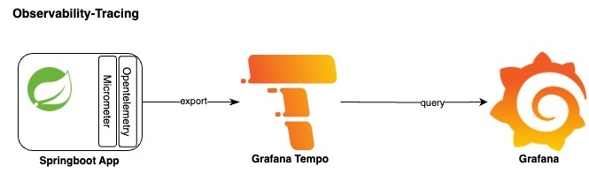

# Observability-Tracing



## Prerequisites

* Tempo server
* Grafana

## Traces setup for springboot3

### Application configuration

1. Add micrometer-tracing-bridge-otel to pom.xml

<table style='font-family:"Courier New", Courier, monospace; font-size:100%'>
    <tr>
        <th colspan="2">Dependencies</th>
    </tr>
    <tr>
        <th>Name</th>
        <th>Description</th>
    </tr>
    <tr>
        <td>micrometer-tracing-bridge-otel</td>
        <td>Used to bridge Micrometer’s tracing functionality with OpenTelemetry. It allows you to continue using Micrometer for instrumentation while exporting tracing data to OpenTelemetry</td>
    </tr>
    <tr>
        <td>opentelemetry-exporter-otlp</td>
        <td>Used to export telemetry data(traces, metrics & logs) to OpenTelemetry Collector or directly to a backend that supports the OpenTelemetry otlp Protocol.
         Few backend that supports otlp are Loki, Tempo, Jaeger, Zipkin, Prometheus, Elasticsearch etc.</td>
    </tr>
    <tr>
        <td>opentelemetry-sdk-testing</td>
        <td>For testing</td>
    </tr>
</table>

2. Update the application.xml

```
management:
  tracing:
    enabled: true
    sampling:
      probability: 1.0
  otlp:
    tracing:
      endpoint: http://tempo.tempo.svc.cluster.local:4318/v1/traces #tempo grpc endpoint
    metrics:
      export:
        enabled: false
  observations:
    key-values:
      application: app2-microservice
```

3. Add custom configuration class to skip tracing of actuator endpoints

```
  @Bean
  @ConditionalOnProperty("management.tracing.enabled")
  public ObservationRegistryCustomizer<ObservationRegistry> skipActuatorEndpointsFromObservation() {
    log.debug("Using custom skipActuatorEndpointsFromObservation bean to skip actuator endpoints");
    final var pathMatcher = new AntPathMatcher("/");
    return registry ->
        registry.observationConfig().observationPredicate(observationPredicate(pathMatcher));
  }

  private ObservationPredicate observationPredicate(final PathMatcher pathMatcher) {
    return (observationName, context) -> {
      if (context instanceof ServerRequestObservationContext observationContext) {
        return !pathMatcher.match("/actuator/**", observationContext.getCarrier().getRequestURI());
      } else {
        return false;
      }
    };
  }
```

### Troubleshooting & Testing the tracing in grafana

### Check Traces for an App in grafana ui

```
login to grafana ui select 'Explore' from main menu
select 'Tempo' as the source 
select 'search' tab and from 'Service Name' drope-down select the appropriate app and click 'Run Query'
```

