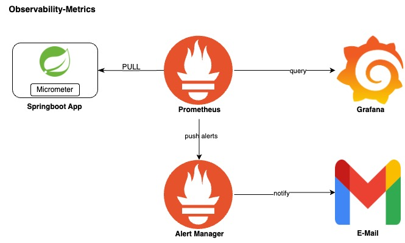

# Observability-Tracing



## Prerequisites

* Tempo server
* Grafana

## Traces setup for springboot3

### Application configuration

1. Add micrometer-tracing-bridge-otel to pom.xml

<table style='font-family:"Courier New", Courier, monospace; font-size:100%'>
    <tr>
        <th colspan="2">Dependencies</th>
    </tr>
    <tr>
        <th>Name</th>
        <th>Description</th>
    </tr>
    <tr>
        <td>micrometer-tracing-bridge-otel</td>
        <td>Used to bridge Micrometer’s tracing functionality with OpenTelemetry. It allows you to continue using Micrometer for instrumentation while exporting tracing data to OpenTelemetry</td>
    </tr>
    <tr>
        <td>opentelemetry-exporter-otlp</td>
        <td>Used to export telemetry data(traces, metrics & logs) to OpenTelemetry Collector or directly to a backend that supports the OpenTelemetry otlp Protocol.
         Few backend that supports otlp are Loki, Tempo, Jaeger, Zipkin, Prometheus, Elasticsearch etc.</td>
    </tr>
    <tr>
        <td>opentelemetry-sdk-testing</td>
        <td>For testing</td>
    </tr>
</table>

2. Update the application.xml

```
management:
  endpoints:
    web:
      exposure:
        include: health,info,metrics,prometheus
  metrics:
    distribution:
      percentiles-histogram:
        http:
          server:
            requests: 'true'
    tags:
      application: app2-microservice
```

3. Add custom configuration class to skip tracing of actuator endpoints

```

```

### Troubleshooting & Testing the tracing in grafana

### Check metrics in grafana ui

```
login to grafana ui select 'Explore' from main menu
select '' as the source 
In the label filters drope-down select 'application' 
After selecting 'application' the adjacent drope-down will list the available apps
select your app name and execute click 'Run Query' to see results  
```

